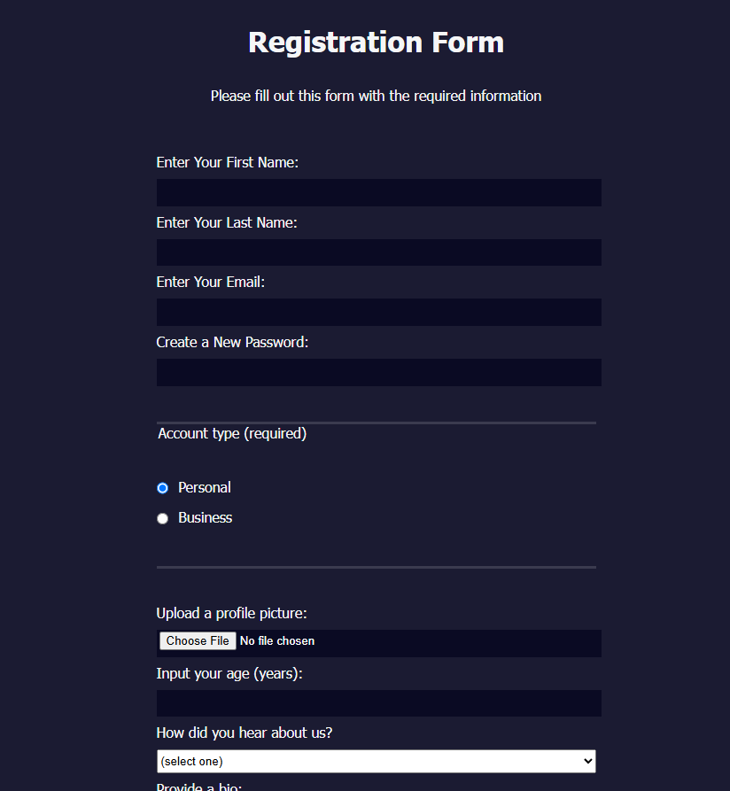

# 📝 2.1.3 FreeCodeCamp Registration Form

Энэ бол FreeCodeCamp.org сайтын **Registration Form** workshop-ийн даалгаврын кодын жишээ юм.  
HTML болон CSS ашиглан бүртгэлийн форм хэрхэн бүтээхийг сурах зорилготой.

---

## 📸 Демо

🔗 Live Preview: [https://2-1-3-registration-form.vercel.app/](https://2-1-3-registration-form.vercel.app/)

 Screenshot нэмэх бол дараах мөрийг ашиглана

---

## 🛠 Ашигласан технологи

- HTML5  
- CSS3  
- FreeCodeCamp Registration Form Workshop  
- Static Site (No JavaScript)

---

## 📂 Кодыг ашиглах

> 🟡 **Энэ репог клон хийх шаардлагагүй.**  
> Зүгээр жишээг уншиж, кодын шийдлийг судлаарай. Хүсвэл өөрийн `.html` файлд туршиж үзэж болно.

---

## ✅ Workshop тайлбар

- Энэ код нь **FreeCodeCamp Registration Form** workshop-ийн **Step 60** буюу хамгийн сүүлийн даалгавар болох:
  > "terms and conditions" линк-д `#dfdfe2` өнгө өгөх
  - `a { color: #dfdfe2; }` selector ашиглаж шийдсэн.

🎉 Амжилттай дуусгасан хувилбар тул сурагчид жишээ болгон ашиглаж болно.

---

## 🧠 Зорилго

- HTML form tag, input, label, select, checkbox гэх мэт элементүүдийг зөв хэрэглэж сурах  
- CSS стилинг ашиглан энгийн бүртгэлийн форм загварчлах  
- Workshop-ийн даалгаврыг бүрэн гүйцэтгэж сурсан байдлаа баталгаажуулах

---

## 🪪 Лиценз

MIT License – Та энэ төслийг чөлөөтэй ашиглаж, өөрчилж, дахин ашиглаж болно.

---

## 📝 Тайлбар

> 💡 **Step давах үед мэдэхгүй, чадахгүй код байвал энэ репо-г нээж, жишээг нь хараарай.**  
> 🤝 Хүсвэл багшаасаа асуугаарай — бүгд хамтдаа суралцаж байна!
